# 📊 SmartPark UML - Mermaid Diagrams

**Aplikasi:** SmartPark - Smart Parking Management System  
**Format:** Mermaid.js (Compatible with GitHub, PlantUML, Markdown editors)  
**Tanggal:** November 12, 2025  
**Versi:** 1.0.0

> **Cara Menggunakan:**
> - Copy kode Mermaid dan paste ke GitHub Markdown
> - Gunakan di [Mermaid Live Editor](https://mermaid.live/)
> - Render di VS Code dengan extension "Markdown Preview Mermaid Support"
> - Export ke PNG/SVG untuk dokumentasi

---

## 📑 Daftar Isi

1. [Use Case Diagram](#1-use-case-diagram)
2. [Activity Diagrams](#2-activity-diagrams)
3. [Sequence Diagrams](#3-sequence-diagrams)
4. [Class Diagrams](#4-class-diagrams)
5. [State Diagrams](#5-state-diagrams)
6. [Entity Relationship Diagram](#6-entity-relationship-diagram)
7. [Flowcharts](#7-flowcharts)

---

## 1. Use Case Diagram

### 1.1 Use Case Diagram - SmartPark System

```mermaid
%%{init: {'theme':'base'}}%%
graph TB
    subgraph SmartPark["🚗 SmartPark System"]
        UC01[UC-01: Login/Register]
        UC02[UC-02: Lihat Profil]
        UC03[UC-03: Edit Profil & Upload Foto]
        UC04[UC-04: Lihat Dashboard]
        UC05[UC-05: Cari Slot Parkir]
        UC06[UC-06: Lihat Map Lokasi]
        UC07[UC-07: Booking Slot Parkir]
        UC08[UC-08: Pembayaran]
        UC09[UC-09: Lihat Riwayat]
        UC10[UC-10: Lihat Statistik]
        UC11[UC-11: Chat AI Assistant]
        UC12[UC-12: Toggle Dark Mode]
        UC13[UC-13: Atur Preferensi]
    end
    
    User((👤 User))
    Firebase[(🔐 Firebase Auth)]
    Firestore[(📊 Firestore)]
    Payment[💳 Payment Gateway]
    AI[🤖 AI Assistant]
    
    User -->|melakukan| UC01
    User -->|melihat| UC02
    User -->|mengedit| UC03
    User -->|melihat| UC04
    User -->|mencari| UC05
    User -->|melihat| UC06
    User -->|booking| UC07
    User -->|membayar| UC08
    User -->|melihat| UC09
    User -->|melihat| UC10
    User -->|chat dengan| UC11
    User -->|toggle| UC12
    User -->|mengatur| UC13
    
    UC01 -.->|menggunakan| Firebase
    UC01 -.->|menyimpan ke| Firestore
    UC03 -.->|upload ke| Firestore
    UC05 -.->|fetch dari| Firestore
    UC07 -.->|update| Firestore
    UC08 -.->|proses| Payment
    UC08 -.->|simpan ke| Firestore
    UC09 -.->|fetch dari| Firestore
    UC10 -.->|fetch dari| Firestore
    UC11 -.->|query| AI
    
    style SmartPark fill:#e1f5ff,stroke:#01579b,stroke-width:3px
    style User fill:#fff9c4,stroke:#f57f17,stroke-width:2px
    style Firebase fill:#fce4ec,stroke:#c2185b,stroke-width:2px
    style Firestore fill:#f3e5f5,stroke:#7b1fa2,stroke-width:2px
    style Payment fill:#e8f5e9,stroke:#388e3c,stroke-width:2px
    style AI fill:#fff3e0,stroke:#e65100,stroke-width:2px
```

---

## 2. Activity Diagrams

### 2.1 Activity Diagram - Login & Register Process

```mermaid
%%{init: {'theme':'base'}}%%
flowchart TD
    Start([🚀 Start]) --> OpenApp[📱 Buka Aplikasi]
    OpenApp --> HasAccount{🤔 Sudah punya<br/>akun?}
    
    HasAccount -->|❌ Belum| SignUp[📝 Pilih Sign Up]
    HasAccount -->|✅ Sudah| Login[🔑 Pilih Login]
    
    SignUp --> InputSignUp[⌨️ Input Email<br/>& Password]
    Login --> InputLogin[⌨️ Input Email<br/>& Password]
    
    InputSignUp --> CreateUser[🔐 Firebase Auth<br/>Create User]
    InputLogin --> SignInUser[🔐 Firebase Auth<br/>Sign In]
    
    CreateUser --> AuthSuccess{✅ Berhasil?}
    SignInUser --> AuthSuccess
    
    AuthSuccess -->|❌ Gagal| ShowError[⚠️ Tampilkan Error]
    ShowError --> HasAccount
    
    AuthSuccess -->|✅ Sukses| CreateUserData[📊 Buat/Get User Data<br/>di Firestore]
    CreateUserData --> RedirectHome[🏠 Redirect ke<br/>Home/Dashboard]
    RedirectHome --> End([✨ End])
    
    style Start fill:#4caf50,stroke:#2e7d32,color:#fff
    style End fill:#f44336,stroke:#c62828,color:#fff
    style AuthSuccess fill:#ff9800,stroke:#e65100,color:#fff
    style HasAccount fill:#2196f3,stroke:#1565c0,color:#fff
    style CreateUserData fill:#9c27b0,stroke:#6a1b9a,color:#fff
    style RedirectHome fill:#4caf50,stroke:#2e7d32,color:#fff
```

### 2.2 Activity Diagram - Booking Slot Parkir

```mermaid
%%{init: {'theme':'base'}}%%
flowchart TD
    Start([🚀 Start]) --> OpenSlots[📋 Masuk Halaman<br/>Slots]
    OpenSlots --> FetchData[📥 Fetch Data Slot<br/>dari Firestore]
    FetchData --> DisplayList[📱 Tampilkan List<br/>Slot Parkir]
    DisplayList --> SelectSlot[👆 User Pilih Slot]
    
    SelectSlot --> CheckAvailable{🟢 Slot<br/>Available?}
    CheckAvailable -->|❌ Tidak| ShowFull[⚠️ Tampilkan<br/>'Slot Full']
    ShowFull --> DisplayList
    
    CheckAvailable -->|✅ Ya| ShowDetail[📄 Tampilkan Detail<br/>Slot & Harga]
    ShowDetail --> ConfirmBooking[✅ User Konfirmasi<br/>Booking]
    ConfirmBooking --> CheckBalance[💰 Cek Saldo User]
    
    CheckBalance --> BalanceOK{💵 Saldo<br/>Cukup?}
    BalanceOK -->|❌ Tidak| ShowInsufficient[⚠️ Tampilkan<br/>'Saldo Kurang']
    ShowInsufficient --> DisplayList
    
    BalanceOK -->|✅ Ya| UpdateSlot[🔄 Update Slot<br/>Status=Occupied]
    UpdateSlot --> CreatePayment[📝 Buat Payment<br/>Record]
    CreatePayment --> DeductBalance[💸 Kurangi Saldo<br/>User]
    DeductBalance --> GenerateQR[📱 Generate QR<br/>Payment Code]
    GenerateQR --> ShowConfirm[✨ Tampilkan<br/>Konfirmasi]
    ShowConfirm --> End([🎉 End])
    
    style Start fill:#4caf50,stroke:#2e7d32,color:#fff
    style End fill:#f44336,stroke:#c62828,color:#fff
    style CheckAvailable fill:#ff9800,stroke:#e65100,color:#fff
    style BalanceOK fill:#ff9800,stroke:#e65100,color:#fff
    style UpdateSlot fill:#2196f3,stroke:#1565c0,color:#fff
    style GenerateQR fill:#9c27b0,stroke:#6a1b9a,color:#fff
    style ShowConfirm fill:#4caf50,stroke:#2e7d32,color:#fff
```

### 2.3 Activity Diagram - Upload Foto Profil

```mermaid
%%{init: {'theme':'base'}}%%
flowchart TD
    Start([🚀 Start]) --> OpenProfile[👤 User Buka<br/>Halaman Profil]
    OpenProfile --> TapPhoto[📸 User Tap Foto<br/>Profil]
    TapPhoto --> OpenPicker[🖼️ Buka Image Picker<br/>Gallery]
    
    OpenPicker --> UserSelect{🤔 User Pilih<br/>Foto?}
    UserSelect -->|❌ Tidak| Cancel[❌ Cancel]
    Cancel --> End([✨ End])
    
    UserSelect -->|✅ Ya| LoadImage[📥 Load Selected<br/>Image]
    LoadImage --> ResizeImage[🔧 Resize Image<br/>512x512px<br/>Quality: 85%]
    ResizeImage --> UpdateState[🔄 Update State<br/>_localImagePath]
    UpdateState --> SaveFirestore[💾 Save Path ke<br/>Firestore<br/>avatar_path]
    SaveFirestore --> ShowSnackbar[✅ Tampilkan<br/>SnackBar Sukses]
    ShowSnackbar --> RefreshUI[🎨 Refresh UI<br/>Tampilkan Foto]
    RefreshUI --> End
    
    style Start fill:#4caf50,stroke:#2e7d32,color:#fff
    style End fill:#f44336,stroke:#c62828,color:#fff
    style UserSelect fill:#ff9800,stroke:#e65100,color:#fff
    style ResizeImage fill:#2196f3,stroke:#1565c0,color:#fff
    style SaveFirestore fill:#9c27b0,stroke:#6a1b9a,color:#fff
    style ShowSnackbar fill:#4caf50,stroke:#2e7d32,color:#fff
```

---

## 3. Sequence Diagrams

### 3.1 Sequence Diagram - Login Process


### 3.2 Sequence Diagram - Booking Slot Parkir

```mermaid
%%{init: {'theme':'base'}}%%
sequenceDiagram
    actor User as 👤 User
    participant SP as 📋 SlotsPage
    participant SS as 🔧 SlotService
    participant FS as 📊 Firestore
    participant PS as 💳 PaymentService
    participant HP as 🏠 HomePage
    
    User->>SP: 1. Browse Slots
    SP->>SS: 2. fetchSlots()
    SS->>FS: 3. Query Slots Collection
    FS-->>SS: 4. Return List<Slot>
    SS-->>SP: 5. Return Slots
    SP-->>User: 6. Display Slots
    
    User->>SP: 7. Tap Slot
    User->>SP: 8. Confirm Booking
    
    SP->>SS: 9. bookSlot(slotId, userId)
    activate SS
    
    SS->>PS: 10. Get User Balance
    PS-->>SS: 11. Return Balance
    
    alt Saldo Cukup
        SS->>FS: 12. Update Slot Status
        SS->>PS: 13. Create Payment Record
        PS->>FS: 14. Save Payment
        SS->>PS: 15. Adjust Balance (-amount)
        PS->>FS: 16. Update Balance
        SS-->>SP: 17. Success
        SP-->>User: 18. Show SnackBar Success
        SP->>HP: 19. Navigate to Home
    else Saldo Tidak Cukup
        SS-->>SP: 17. Error: Insufficient Balance
        SP-->>User: 18. Show Error Message
    end
    
    deactivate SS
    
    Note over User,HP: Booking berhasil!<br/>Saldo berkurang
```

### 3.3 Sequence Diagram - Upload Foto Profil

```mermaid
%%{init: {'theme':'base'}}%%
sequenceDiagram
    actor User as 👤 User
    participant PP as 👤 ProfilePage
    participant IP as 🖼️ ImagePicker
    participant FS as 💾 FileSystem
    participant FB as 📊 Firestore
    participant UI as 🎨 UI
    
    User->>PP: 1. Tap Photo
    PP->>IP: 2. pickImage()
    IP-->>User: 3. Open Gallery
    
    User->>IP: 4. Select Image
    IP-->>PP: 5. Return XFile
    
    PP->>PP: 6. Resize (512x512, 85%)
    PP->>PP: 7. setState(_localImagePath)
    PP->>UI: 8. Update UI State
    
    PP->>FB: 9. Save to Firestore<br/>users/{uid}.avatar_path
    activate FB
    FB-->>PP: 10. Success
    deactivate FB
    
    PP->>UI: 11. Show SnackBar<br/>"Foto berhasil diubah!"
    UI-->>User: 12. Display Updated Photo
    
    Note over User,UI: Foto profil berhasil<br/>di-update!
```

### 3.4 Sequence Diagram - Dark Mode Toggle

```mermaid
%%{init: {'theme':'base'}}%%
sequenceDiagram
    actor User as 👤 User
    participant HP as 🏠 HomePage
    participant TP as 🎨 ThemeProvider
    participant SP as 💾 SharedPrefs
    participant UI as 📱 UI
    
    User->>HP: 1. Tap Dark Mode Toggle
    HP->>TP: 2. toggleTheme()
    
    activate TP
    TP->>TP: 3. _isDarkMode = !_isDarkMode
    TP->>SP: 4. Save to SharedPreferences
    activate SP
    SP-->>TP: 5. Success
    deactivate SP
    
    TP->>UI: 6. notifyListeners()
    deactivate TP
    
    UI-->>UI: 7. Rebuild All Widgets
    UI-->>User: 8. Show Updated Theme
    
    Note over User,UI: Theme berubah<br/>ke Dark/Light Mode
```

### 3.5 Sequence Diagram - AI Assistant Chat

```mermaid
%%{init: {'theme':'base'}}%%
sequenceDiagram
    actor User as 👤 User
    participant AP as 💬 AssistantPage
    participant AI as 🤖 AI Service
    participant FS as 📊 Firestore
    participant UI as 📱 UI
    
    User->>AP: 1. Type Message
    User->>AP: 2. Tap Send
    
    AP->>UI: 3. Add User Message to List
    AP->>UI: 4. Show Loading Indicator
    
    AP->>FS: 5. Get User Context<br/>(balance, bookings)
    FS-->>AP: 6. Return User Data
    
    AP->>AI: 7. Send Query + Context
    activate AI
    AI-->>AI: Generate Response...
    AI-->>AP: 8. Return AI Response
    deactivate AI
    
    AP->>UI: 9. Add AI Message to List
    AP->>UI: 10. Hide Loading
    AP->>UI: 11. Auto Scroll to Bottom
    
    UI-->>User: 12. Display AI Response
    
    Note over User,UI: User dapat melanjutkan<br/>percakapan
```

---

## 4. Class Diagrams

### 4.1 Class Diagram - Model Classes


### 4.2 Class Diagram - Service Classes


### 4.3 Class Diagram - Page Classes


### 4.4 Class Diagram - Provider & State Management


---

## 5. State Diagrams

### 5.1 State Diagram - Slot Status


### 5.2 State Diagram - Payment Status


### 5.3 State Diagram - User Session


---

## 6. Entity Relationship Diagram

### 6.1 ER Diagram - Firestore Collections


---

## 7. Flowcharts

### 7.1 Flowchart - App Initialization

```mermaid
%%{init: {'theme':'base'}}%%
flowchart TD
    Start([📱 App Start]) --> InitFirebase[🔥 Initialize Firebase]
    InitFirebase --> LoadTheme[🎨 Load Theme Preference<br/>from SharedPrefs]
    LoadTheme --> CheckAuth{🔐 User<br/>Logged In?}
    
    CheckAuth -->|✅ Yes| ValidateToken{🔑 Token<br/>Valid?}
    CheckAuth -->|❌ No| ShowLogin[📝 Show LoginPage]
    
    ValidateToken -->|✅ Valid| LoadUserData[📊 Load User Data<br/>from Firestore]
    ValidateToken -->|❌ Expired| ShowLogin
    
    LoadUserData --> InitServices[🔧 Initialize Services<br/>Payment, User, Slot]
    InitServices --> ShowHome[🏠 Show HomePage]
    
    ShowLogin --> End([✨ Ready])
    ShowHome --> End
    
    style Start fill:#4caf50,stroke:#2e7d32,color:#fff
    style End fill:#f44336,stroke:#c62828,color:#fff
    style CheckAuth fill:#ff9800,stroke:#e65100,color:#fff
    style ValidateToken fill:#ff9800,stroke:#e65100,color:#fff
    style ShowHome fill:#2196f3,stroke:#1565c0,color:#fff
```

### 7.2 Flowchart - Payment Processing

```mermaid
%%{init: {'theme':'base'}}%%
flowchart TD
    Start([💳 Start Payment]) --> CheckBalance{💰 Check<br/>Balance}
    
    CheckBalance -->|❌ Insufficient| ShowError1[⚠️ Show Error<br/>Saldo Tidak Cukup]
    ShowError1 --> OfferTopUp{💵 Offer<br/>Top Up?}
    OfferTopUp -->|✅ Yes| TopUpFlow[💳 Top Up Flow]
    OfferTopUp -->|❌ No| Cancel1[❌ Cancel Payment]
    TopUpFlow --> CheckBalance
    
    CheckBalance -->|✅ Sufficient| CreatePayment[📝 Create Payment<br/>Record]
    CreatePayment --> GenerateQR[📱 Generate QR Code]
    GenerateQR --> ShowQR[📲 Show QR to User]
    
    ShowQR --> WaitConfirm{⏳ Wait for<br/>Confirmation}
    WaitConfirm -->|⏱️ Timeout| Cancel2[❌ Cancel Payment]
    WaitConfirm -->|✅ Confirmed| ProcessPayment[💸 Process Payment]
    
    ProcessPayment --> DeductBalance[💰 Deduct Balance]
    DeductBalance --> UpdateSlot[🔄 Update Slot Status]
    UpdateSlot --> SendNotif[📩 Send Notification]
    SendNotif --> Success[✅ Payment Success]
    
    Cancel1 --> End([End])
    Cancel2 --> End
    Success --> End
    
    style Start fill:#4caf50,stroke:#2e7d32,color:#fff
    style Success fill:#4caf50,stroke:#2e7d32,color:#fff
    style End fill:#f44336,stroke:#c62828,color:#fff
    style CheckBalance fill:#ff9800,stroke:#e65100,color:#fff
    style WaitConfirm fill:#ff9800,stroke:#e65100,color:#fff
```

### 7.3 Flowchart - Error Handling

```mermaid
%%{init: {'theme':'base'}}%%
flowchart TD
    Start([⚡ Operation Start]) --> TryCatch[🔧 Try Execute]
    
    TryCatch -->|✅ Success| Return[✨ Return Result]
    Return --> End([End])
    
    TryCatch -->|❌ Error| CheckError{🔍 Check<br/>Error Type}
    
    CheckError -->|🌐 Network Error| ShowNetworkError[📡 Show Network Error<br/>Check Connection]
    CheckError -->|🔐 Auth Error| HandleAuthError[🔑 Handle Auth Error<br/>Redirect to Login]
    CheckError -->|📊 Firestore Error| ShowFirestoreError[⚠️ Show Database Error<br/>Try Again]
    CheckError -->|❓ Unknown Error| ShowGenericError[⚠️ Show Generic Error<br/>Contact Support]
    
    ShowNetworkError --> OfferRetry{🔄 Offer<br/>Retry?}
    ShowFirestoreError --> OfferRetry
    
    OfferRetry -->|✅ Yes| TryCatch
    OfferRetry -->|❌ No| LogError[📝 Log Error to Console]
    
    HandleAuthError --> ClearSession[🗑️ Clear Session]
    ClearSession --> RedirectLogin[➡️ Redirect to Login]
    RedirectLogin --> End
    
    ShowGenericError --> LogError
    LogError --> End
    
    style Start fill:#4caf50,stroke:#2e7d32,color:#fff
    style Return fill:#4caf50,stroke:#2e7d32,color:#fff
    style End fill:#f44336,stroke:#c62828,color:#fff
    style CheckError fill:#ff9800,stroke:#e65100,color:#fff
    style OfferRetry fill:#2196f3,stroke:#1565c0,color:#fff
```

### 7.4 Flowchart - Data Synchronization

```mermaid
%%{init: {'theme':'base'}}%%
flowchart TD
    Start([🔄 Sync Start]) --> CheckConnection{🌐 Internet<br/>Available?}
    
    CheckConnection -->|❌ No| QueueOffline[📦 Queue Changes<br/>in Local Storage]
    QueueOffline --> WaitConnection[⏳ Wait for Connection]
    WaitConnection --> CheckConnection
    
    CheckConnection -->|✅ Yes| FetchRemote[📥 Fetch Remote Data<br/>from Firestore]
    FetchRemote --> CompareData{🔍 Compare with<br/>Local Data}
    
    CompareData -->|📊 Same| NoUpdate[✅ No Update Needed]
    NoUpdate --> End([End])
    
    CompareData -->|🔄 Different| CheckConflict{⚠️ Conflict<br/>Detected?}
    
    CheckConflict -->|❌ No Conflict| UpdateLocal[💾 Update Local Data]
    UpdateLocal --> NotifyUI[🎨 Notify UI to Refresh]
    NotifyUI --> End
    
    CheckConflict -->|✅ Conflict| ResolveConflict[🔧 Resolve Conflict<br/>Last Write Wins]
    ResolveConflict --> UpdateLocal
    
    style Start fill:#4caf50,stroke:#2e7d32,color:#fff
    style End fill:#f44336,stroke:#c62828,color:#fff
    style CheckConnection fill:#ff9800,stroke:#e65100,color:#fff
    style CompareData fill:#2196f3,stroke:#1565c0,color:#fff
    style CheckConflict fill:#ff9800,stroke:#e65100,color:#fff
```

---

## 8. Component Diagram

### 8.1 Component Diagram - App Architecture

```mermaid
%%{init: {'theme':'base'}}%%
graph TB
    subgraph "📱 Mobile App - Flutter"
        subgraph "🎨 Presentation Layer"
            UI[UI Widgets<br/>Pages & Components]
        end
        
        subgraph "🔧 Business Logic Layer"
            Provider[State Management<br/>Provider]
            Services[Services<br/>Payment, User, Slot]
        end
        
        subgraph "📊 Data Layer"
            Models[Data Models<br/>Payment, Slot, User]
            Local[Local Storage<br/>SharedPreferences]
        end
    end
    
    subgraph "☁️ Backend Services"
        Auth[Firebase Auth]
        Firestore[Cloud Firestore]
        Storage[Firebase Storage]
    end
    
    subgraph "🔌 External APIs"
        Payment[Payment Gateway]
        AI[AI Service]
        Maps[Google Maps]
    end
    
    UI --> Provider
    UI --> Services
    Provider --> Services
    Services --> Models
    Services --> Local
    
    Services --> Auth
    Services --> Firestore
    Services --> Storage
    Services --> Payment
    Services --> AI
    Services --> Maps
    
    style UI fill:#e3f2fd,stroke:#1976d2
    style Provider fill:#f3e5f5,stroke:#7b1fa2
    style Services fill:#fff3e0,stroke:#f57c00
    style Models fill:#e8f5e9,stroke:#388e3c
    style Auth fill:#ffebee,stroke:#c62828
    style Firestore fill:#fce4ec,stroke:#c2185b
```

---

## 9. Deployment View

### 9.1 Deployment Diagram - System Architecture

```mermaid
%%{init: {'theme':'base'}}%%
graph TB
    subgraph "📱 Client Devices"
        Android[🤖 Android Device]
        iOS[📱 iOS Device]
        Web[🌐 Web Browser]
    end
    
    subgraph "☁️ Firebase Platform"
        subgraph "🔐 Authentication"
            Auth[Firebase Auth<br/>Email/Password]
        end
        
        subgraph "📊 Database"
            Firestore[Cloud Firestore<br/>NoSQL Database]
        end
        
        subgraph "💾 Storage"
            Storage[Firebase Storage<br/>Images, Files]
        end
        
        subgraph "🌐 Hosting"
            Hosting[Firebase Hosting<br/>Web App]
        end
    end
    
    subgraph "🔌 External Services"
        Payment[💳 Payment Gateway<br/>QRIS, E-Wallet]
        AI[🤖 AI Service<br/>ChatGPT API]
        Maps[🗺️ Google Maps<br/>Location Services]
    end
    
    Android -->|HTTPS| Auth
    iOS -->|HTTPS| Auth
    Web -->|HTTPS| Hosting
    Hosting --> Auth
    
    Android -->|WSS| Firestore
    iOS -->|WSS| Firestore
    Web -->|WSS| Firestore
    
    Android --> Storage
    iOS --> Storage
    Web --> Storage
    
    Firestore -.->|Trigger| Payment
    Firestore -.->|Query| AI
    Android --> Maps
    iOS --> Maps
    
    style Android fill:#a5d6a7,stroke:#388e3c
    style iOS fill:#90caf9,stroke:#1976d2
    style Web fill:#ffab91,stroke:#e64a19
    style Auth fill:#ffcdd2,stroke:#c62828
    style Firestore fill:#f48fb1,stroke:#c2185b
    style Storage fill:#ce93d8,stroke:#7b1fa2
    style Hosting fill:#80cbc4,stroke:#00796b
```

---

## 📝 Cara Menggunakan Diagram Ini

### 1. **GitHub Markdown**
Copy kode Mermaid dan paste langsung ke file `.md` di GitHub. GitHub akan otomatis render diagram.

### 2. **Mermaid Live Editor**
- Buka https://mermaid.live/
- Paste kode Mermaid
- Edit sesuai kebutuhan
- Export ke PNG/SVG

### 3. **VS Code**
Install extension:
- "Markdown Preview Mermaid Support"
- "Mermaid Markdown Syntax Highlighting"

### 4. **PlantUML**
Untuk konversi ke PlantUML, gunakan online converter atau manual conversion.

### 5. **Documentation Tools**
Bisa digunakan di:
- Confluence
- Notion
- GitBook
- Docusaurus
- MkDocs

---

## 🎨 Customization

Untuk mengubah theme/warna diagram, edit bagian:
```
%%{init: {'theme':'base'}}%%
```

Theme options:
- `default` - Theme default Mermaid
- `base` - Theme minimal
- `dark` - Theme gelap
- `forest` - Theme hijau
- `neutral` - Theme abu-abu

---

## 📚 Referensi

- **Mermaid Documentation:** https://mermaid.js.org/
- **Mermaid Live Editor:** https://mermaid.live/
- **GitHub Mermaid Support:** https://github.blog/2022-02-14-include-diagrams-markdown-files-mermaid/
- **PlantUML:** https://plantuml.com/

---

**Generated:** November 12, 2025  
**Version:** 1.0.0  
**Format:** Mermaid.js  
**Compatibility:** GitHub, PlantUML, VS Code, Web Browsers

